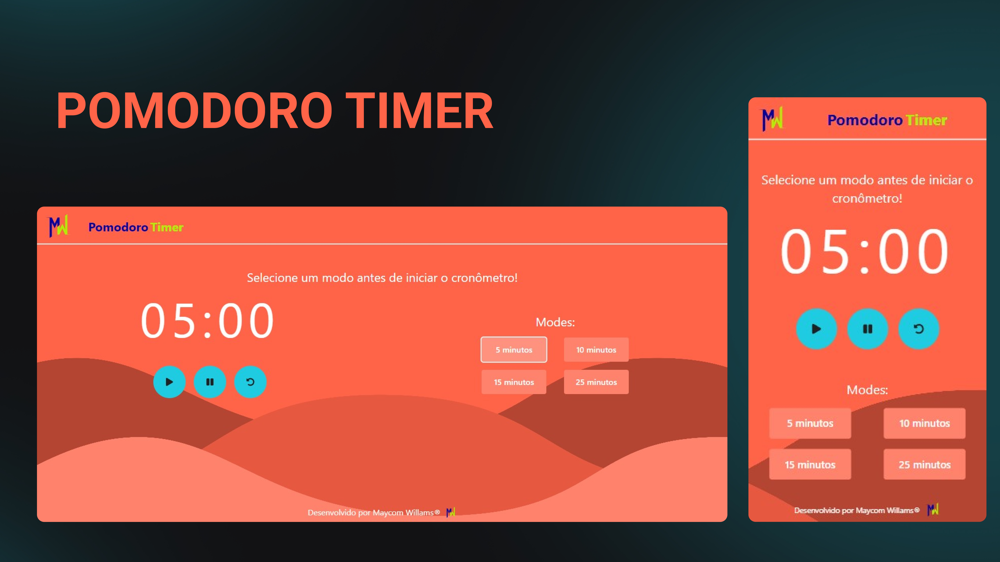

<h1 align="center"> Pomodoro Timer </h1>

Timer estilo pomodoro.  

  <a href="#-tecnologias">Tecnologias</a>&nbsp;|
  <a href="#-projeto">Projeto</a>&nbsp;|
  <a href="#memo-licença">Licença</a>

  

 

  

## 🚀 Tecnologias

Esse projeto foi desenvolvido com as seguintes tecnologias:

## 💻 Projeto

Um timer simples baseado na técnica de pomodoro para estudos.

- [Acesse o projeto finalizado, online](https://pomodoro-react-maycomwill.vercel.app/)

## :pencil: Licença

Esse projeto está sob a licença MIT.
